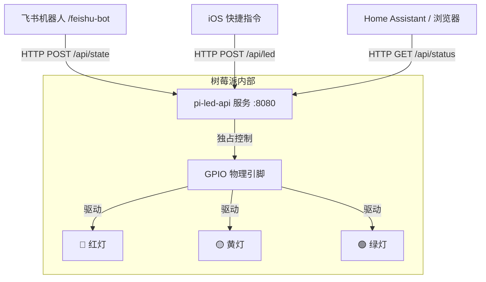

# 🍓 Raspberry Pi LED Control API (树莓派 LED 状态灯 API 控制服务)

这是一个基于 **FastAPI** 开发的 RESTful API 服务，旨在提供一个中心化、轻量级、多平台、多设备通用的树莓派 LED 物理指示灯控制接口。它专为解决多个进程/设备竞争控制物理引脚导致的 `GPIO busy` 资源冲突设计。

---

## 📐 架构设计



---

## 🌟 特性

1. **资源解耦与独占**：充当树莓派 GPIO 接口的代理守护进程，完美解决 `feishu-bot` 与其他脚本同时控制 GPIO 时引起的 `GPIO busy` 硬件锁定错误。
2. **丰富的预设系统状态**：
   - `thinking` (思考中)：常亮黄灯。
   - `breathing` (执行任务中)：呼吸黄灯。
   - `restarting` (服务重启中)：闪烁黄灯。
   - `success` (任务执行完成)：常亮绿灯（支持自定义定时关闭，默认 300 秒）。
   - `error` (执行出错/强制中止)：常亮红灯。
   - `startup` (启动就绪)：绿灯快速闪烁 5 次自检。
   - `off` (关闭)：熄灭所有指示灯。
3. **单灯自定义精细控制**：支持直接控制单个 LED (`red`、`yellow`、`green`) 执行 `on` (常亮)、`off` (关闭)、`pwm` (任意亮度 `0.0~1.0`)、`blink` (指定频率闪烁)、`breath` (指定频率呼吸)。
4. **即刻开箱即用**：
   - 自动检测并改写 Python 虚拟环境（`venv`）中的 [`pyvenv.cfg`](file:///home/user/github/antigravity-feishu-bot/venv/pyvenv.cfg) 配置文件，自动开启系统包继承。
   - 动态热加载系统级预装的 `gpiozero` 与 `lgpio`，解决在隔离 venv 下直接 `pip install` 缺失底层编译依赖导致失败的问题。
   - **非树莓派设备兼容**：若在非树莓派设备（如 macOS / Windows）运行，自动降级为 Mock 模拟日志模式，调试不报错。
5. **CORS 支持**：支持跨域请求，可供前端网页、Home Assistant、iOS 快捷指令直接跨网段请求。

---

## ⚙️ 系统依赖准备 (树莓派)

在树莓派上部署前，请确保系统已安装底层的 GPIO 硬件驱动（Raspberry Pi OS 默认已安装）：
```bash
sudo apt update
sudo apt install -y python3-gpiozero python3-lgpio
```

---

## 🚀 一键部署部署

我们提供了一键配置和启动服务的部署脚本 [`deploy.sh`](file:///home/user/github/pi_led_api/deploy.sh)：

```bash
# 给予执行权限
chmod +x deploy.sh

# 运行部署脚本
./deploy.sh
```

`deploy.sh` 会自动执行以下操作：
1. 检测当前是否为树莓派环境。
2. 创建与系统库连通的 Python 虚拟环境 (`venv`)。
3. 安装依赖包 (`FastAPI`、`Uvicorn`、`Pydantic`)。
4. **服务自启动注册**：
   - 如果系统已安装 **PM2**：自动配置并在 PM2 中启动进程 `pi-led-api`。
   - 如果未安装 PM2：在当前目录生成标准的 **systemd** 服务配置文件 `pi-led-api.service`，并输出注册命令。

---

## 📦 手动部署与启动

如果您希望手动部署服务，可参考以下步骤：

```bash
# 1. 创建虚拟环境 (在树莓派上必须加 --system-site-packages)
python3 -m venv venv --system-site-packages

# 2. 激活虚拟环境并安装依赖
source venv/bin/activate
pip install -r requirements.txt

# 3. 手动启动 Uvicorn 服务 (监听 8080 端口)
python3 -m uvicorn main:app --host 0.0.0.0 --port 8080
```

---

## 🛠️ API 接口详解

API 交互支持标准的 Swagger UI。服务启动后，可在浏览器中直接打开 `http://<树莓派IP>:8080/docs` 查看并在线调试接口。

### 1. 查询指示灯当前状态
*   **请求**：`GET /api/status`
*   **响应 (JSON)**：
    ```json
    {
      "status": "ok",
      "current_state": "breathing_yellow",
      "hardware": {
        "gpio_available": true,
        "mode": "GPIOZERO_LGPIO",
        "pins": {
          "red": 22,
          "yellow": 27,
          "green": 17
        }
      }
    }
    ```

### 2. 设置系统整机状态
*   **请求**：`POST /api/state`
*   **请求体 (JSON)**：
    ```json
    {
      "state": "success",
      "duration": 300
    }
    ```
    *   `state` (必填)：系统状态，可选值：`thinking`, `breathing`, `restarting`, `success`, `error`, `startup`, `off`。
    *   `duration` (可选，仅在 `success` 下生效)：绿灯自动熄灭时长（秒），默认 300 秒。

### 3. 单灯自定义高级控制
*   **请求**：`POST /api/led`
*   **请求体 (JSON)**：
    ```json
    {
      "color": "green",
      "action": "breath",
      "value": 0.8,
      "frequency": 1.5
    }
    ```
    *   `color` (必填)：指定 LED 颜色，可选：`red`、`yellow`、`green`。
    *   `action` (必填)：执行动作，可选：
        - `on`：常亮 (1.0 满亮度)。
        - `off`：常闭 (0.0 亮度)。
        - `pwm`：设定指定亮度值。
        - `blink`：指定频率高低电平闪烁。
        - `breath`：指定频率呼吸。
    *   `value` (可选，默认 1.0)：亮度，范围 `0.0` 到 `1.0`。
    *   `frequency` (可选，默认 1.0)：闪烁/呼吸的频率（Hz），范围 `0.1` 到 `10.0`。

### 4. 熄灭所有灯光
*   **请求**：`POST /api/off`

---

## 💻 跨设备调用代码示例

### Shell (cURL)
```bash
# 点亮红灯以 3Hz 的高频闪烁（告警通知）
curl -X POST http://<树莓派IP>:8080/api/led \
  -H "Content-Type: application/json" \
  -d '{"color": "red", "action": "blink", "value": 1.0, "frequency": 3.0}'

# 熄灭整机所有灯
curl -X POST http://<树莓派IP>:8080/api/off
```

### Python
```python
import requests

# 设定为思考中黄灯
url = "http://<树莓派IP>:8080/api/state"
requests.post(url, json={"state": "thinking"})
```

### Node.js (Fetch)
```javascript
fetch('http://<树莓派IP>:8080/api/state', {
    method: 'POST',
    headers: { 'Content-Type': 'application/json' },
    body: JSON.stringify({ state: 'success', duration: 10 })
});
```

### iOS 快捷指令 (苹果手机控制)
1. 打开 iOS 快捷指令 App，创建新快捷指令。
2. 添加“**获取 URL 内容**”操作。
3. URL 填写：`http://<树莓派局域网IP>:8080/api/state`。
4. 方法选择 `POST`。
5. 请求体选择 `JSON`。
6. 添加键 `state`，类型为文本，值填 `off` (或者其他如 `success`、`thinking`)。
7. 保存到手机桌面，即可实现用手机无线控制树莓派状态灯！
