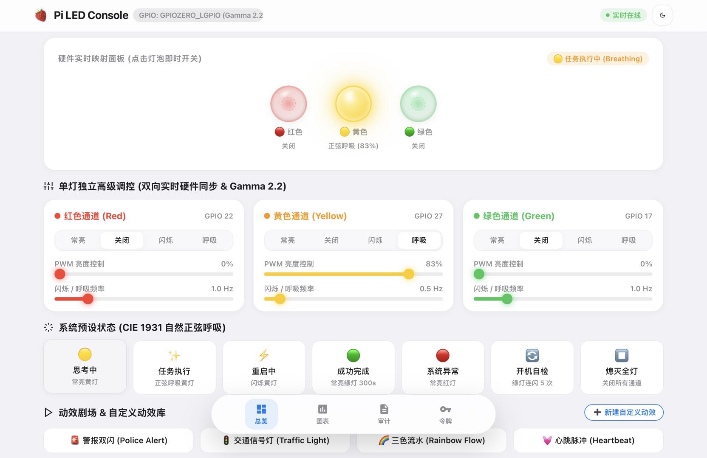
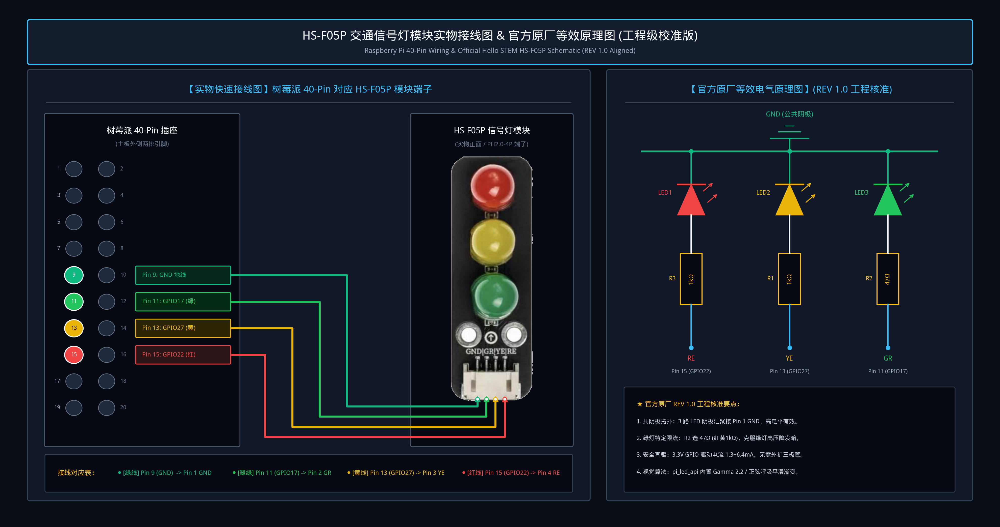
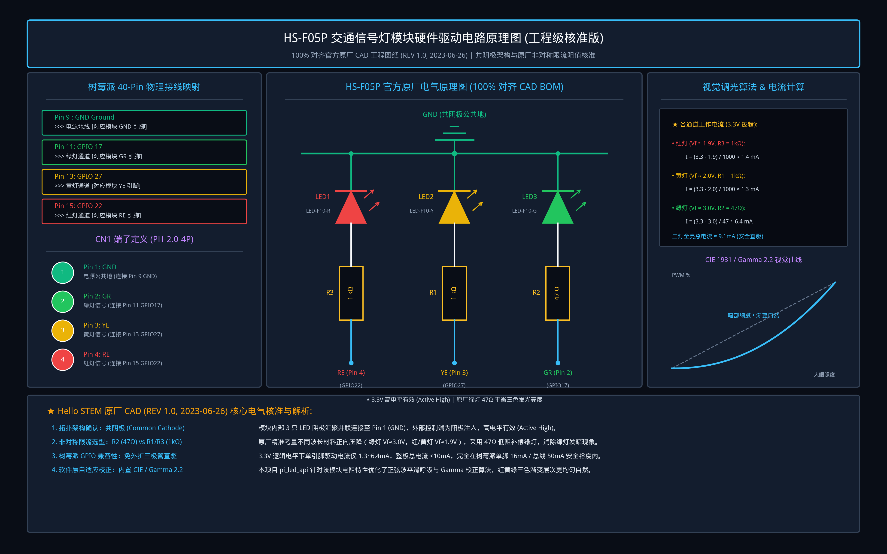
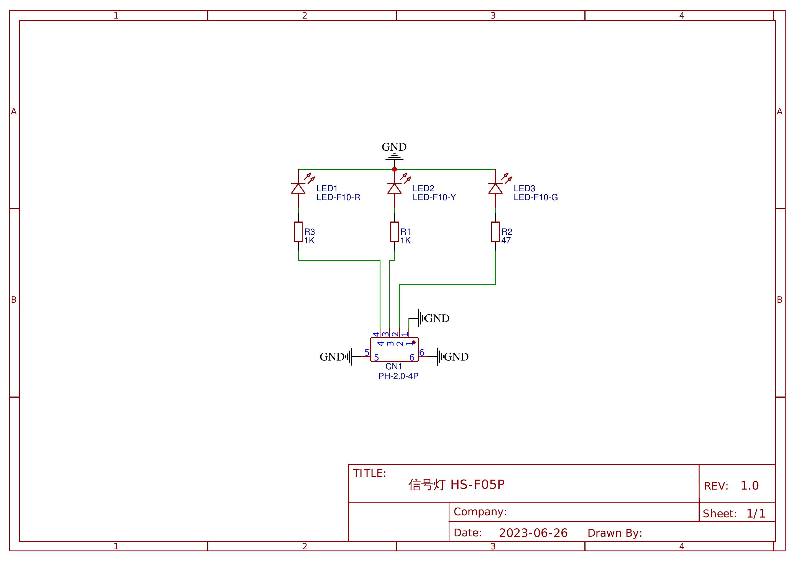

# 🍓 Raspberry Pi LED Control API (v2.4 - Clean Edition)

> 基于 **FastAPI + AsyncIO** 构建的高性能、多通道、集成 **悬浮 Dock 导航栏**、**拟真水晶透镜面板**、**CIE 1931 / Gamma 2.2 视觉平滑呼吸**、**智能倒计时渐暗关灯**、**自定义动效剧场 (Pattern Studio)**、**硬件引脚热重映射**、**审计日志 CSV/JSON 导出** 与 **动态 Token 管理** 的树莓派指示灯中央控制网关服务。

---

## 🖥️ Web 控制台 (Web Console)

本项目内置了精致的毛玻璃拟真水晶透镜 **Web 控制台**，部署后直接在局域网浏览器打开即可使用：

* **访问地址**：`http://<树莓派IP>:8080/` 或 `http://127.0.0.1:8080/`
* **核心模块**：
  1. **拟真透镜触控**：大灯泡实时映射硬件亮灭/呼吸状态，支持直接点击 0ms 快速启闭；
  2. **三色独立高级调控**：红、黄、绿三通道独立切换常亮/关闭/闪烁/正弦呼吸，支持 PWM 亮度（0%~100%）与频率滑动微调；
  3. **系统预设状态**：快速触发思考中、任务执行、重启中、成功完成、系统异常、开机自检等系统联动灯效；
  4. **动效剧场与 Pattern Studio**：警报双闪、交通灯、三色流水、心跳脉冲等复合动效，并支持可视化新增自定义帧动效；
  5. **悬浮 Dock 导航**：集成总览、图表指标、审计调用追踪与多设备 API Token 认证管理。

---

## 🌟 核心功能特性

1. **🌈 CIE 1931 / Gamma 2.2 视觉亮度校正 & 自然正弦呼吸曲线**：
   - 彻底告别生硬线性的 PWM 调节，引入幂律人眼感知校正，使暗部渐变更细腻、亮部层次更分明。
   - 任务执行状态采用连续平滑正弦波呼吸，柔和自然。
2. **🖱️ 拟真面板直接触控交互 (Direct Bulb Touch/Click)**：
   * 在 Web 面板上直接轻触红/黄/绿灯珠，即可 **0ms 零延迟乐观切换** 开关状态。
3. **⏱️ 智能倒计时 & 渐暗关灯引擎 (Smart Timers & Fade-Out)**：
   * 支持指定通道运行倒计时（1分钟、5分钟、25分钟番茄钟等），在倒计时结束前自动平滑减小亮度渐暗至熄灭。
   * Web 端实时显示倒计时进度条与剩余时间。
4. **🎭 自定义动效剧场 (Custom Patterns Studio & Store)**：
   * 支持在线添加多帧动画（配置每帧红黄绿亮度与持续时间），持久化存储至 `data/patterns.json`，一键运行。
5. **🎛️ 硬件引脚热重映射与电平极性配置 (Hardware Pin Mapping)**：
   * 支持在 Web 界面随时修改各通道 BCM GPIO 编号、极性（高电平有效/低电平有效）与 Gamma 开关，配置保存在 `data/hardware.json`，免改代码热生效。
6. **📥 审计调用日志一键导出 (CSV / JSON Export)**：
   * 支持从 Web 控制台或 API 一键将历史调用记录导出下载为 `.csv` 或 `.json` 文件。
7. **🛡️ 纯内存本地极速 OAuth2 JWT 鉴权 (<0.05ms)**：
   * 极速本地优先验签，支持密码登录与多设备专属动态 Token。

---

## 🔌 硬件接线与官方电气原理图

本项目配套 **Hello STEM 凯斯电子 HS-F05P 交通信号灯模块**（工作电压 3.3V ~ 5.5V，PH2.0 4P 端子）。引脚布局与树莓派 40-Pin 物理排针采用**外侧连续引脚直连**（Pin 9、11、13、15），插拔极为便捷。

### 树莓派 40-Pin 物理接线对照表

| 导线颜色 | 模块端子 (PH2.0-4P) | 树莓派物理引脚 (Board) | BCM GPIO | 功能说明 |
| :--- | :--- | :--- | :--- | :--- |
| **🟢 绿线** | **GND** (Pin 1) | **Pin 9 (GND)** | GND | 电源公共地（亦可接 Pin 6 / Pin 14 / Pin 20） |
| **🌲 翠绿线** | **GR** (Pin 2) | **Pin 11** | **GPIO 17** | 绿灯控制通道（高电平点亮，3.3V 直驱） |
| **🟡 黄线** | **YE** (Pin 3) | **Pin 13** | **GPIO 27** | 黄灯控制通道（高电平点亮，3.3V 直驱） |
| **🔴 红线** | **RE** (Pin 4) | **Pin 15** | **GPIO 22** | 红灯控制通道（高电平点亮，3.3V 直驱） |

> 💡 **外侧连续直插优势**：物理引脚 9、11、13、15 处于树莓派外侧排针同一列连续位置，无需跨行插拔，接线规整稳定。

<b>🔍 点击展开：完整驱动电路原理图与官方 CAD 工程图纸 (REV 1.0)</b>

#### HS-F05P 硬件驱动原理图 (工程级核准版)

#### 官方原厂 CAD 原理图 (Hello STEM HS-F05P REV 1.0)

### ⚡ 原厂电路核心设计与电气核准解析

1. **共阴极架构 (Common Cathode)**：
   * 模块内部 3 只 LED 阴极汇聚接至 Pin 1 (GND)，外部控制端为阳极注入，逻辑上为**高电平有效 (Active High)**。
2. **非对称贴片限流电阻选型**：
   * **红灯 (LED1, LED-F10-R)**：串联 **R3 = 1kΩ**，工作电流 $I \approx (3.3V - 1.9V) / 1000\Omega \approx 1.4\text{ mA}$。
   * **黄灯 (LED2, LED-F10-Y)**：串联 **R1 = 1kΩ**，工作电流 $I \approx (3.3V - 2.0V) / 1000\Omega \approx 1.3\text{ mA}$。
   * **绿灯 (LED3, LED-F10-G)**：串联 **R2 = 47Ω**！
     * *设计原因*：绿光 LED 禁带宽度较宽，正向压降高达 $V_F \approx 3.0V$。若同样采用 1kΩ，在 3.3V 逻辑电平下电流仅约 0.3mA 会严重发暗；原厂特设 **47Ω** 低阻，工作电流提升至 $(3.3V - 3.0V) / 47\Omega \approx 6.4\text{ mA}$，使红、黄、绿三色发光亮度完美均衡。
3. **GPIO 直驱安全裕度**：
   * 三灯全亮总功耗电流约为 $1.4\text{ mA} + 1.3\text{ mA} + 6.4\text{ mA} = 9.1\text{ mA}$，远低于树莓派单个 GPIO 16mA 及 3.3V 供电总线 50mA 安全限额，**无需额外三极管放大即可安全长寿命直驱**。
4. **CIE 1931 / Gamma 2.2 视觉调光拟合**：
   * 本系统针对人眼非线性照度感知，在软件层实施 Gamma 2.2 幂律映射，使 PWM 渐变与呼吸呼吸灯暗部细腻、视觉柔和。

---

## 🛠️ API 接口清单

| 接口 | 方法 | 鉴权要求 | 说明 |
| :--- | :--- | :--- | :--- |
| `/` | `GET` | 无 | 现代 Web 控制台 (带悬浮 Dock 导航与拟真透镜) |
| `/docs` | `GET` | 无 | Swagger UI 交互式在线调试文档 |
| `/api/status` | `GET` | 无 | 获取当前整机、各通道、硬件引脚及倒计时状态快照 |
| `/api/state` | `POST` | 需 Token | 切换系统统一预设状态 (thinking, breathing, success, error, off) |
| `/api/led` | `POST` | 需 Token | 独立/独占控制单灯通道 (支持 on/off/pwm/blink/breath) |
| `/api/off` | `POST` | 需 Token | 一键熄灭所有通道 |
| `/api/timer` | `POST` | 需 Token | 启动智能倒计时 (支持设置结束前平滑渐暗秒数) |
| `/api/timer` | `DELETE` | 需 Token | 提前取消正在运行的倒计时 |
| `/api/patterns` | `GET` | 无 | 获取所有内置与自定义动效列表 |
| `/api/patterns` | `POST` | 需 Token | 保存新的自定义动效帧序列 |
| `/api/patterns/{name}` | `DELETE` | 需 Token | 删除指定的自定义动效 |
| `/api/pattern` | `POST` | 需 Token | 运行指定名称或自定义帧的动效 |
| `/api/hardware/config` | `GET` | 无 | 获取当前硬件引脚及极性配置 |
| `/api/hardware/config` | `POST` | 需 Token | 动态修改引脚编号与极性并热重载 |
| `/api/logs` | `GET` | 无 | 查询调用审计记录 (支持 device / status 过滤) |
| `/api/logs/export` | `GET` | 无 | 导出下载审计日志 (`?format=csv` 或 `?format=json`) |
| `/api/tokens` | `GET` | 无 | 查询所有已颁发与配置的 Token 列表 |
| `/api/tokens/create` | `POST` | 需 Token | 在线生成设备专属 API 访问令牌 |
| `/api/tokens/{id}` | `DELETE` | 需 Token | 撤销并删除指定的动态 Token |
| `/api/oauth/token` | `POST` | 无 | 密码或设备 Token 换取 JWT 访问令牌 |
| `/ws/status` | `WebSocket` | 无 | 实时状态与审计日志广播长连接 |
